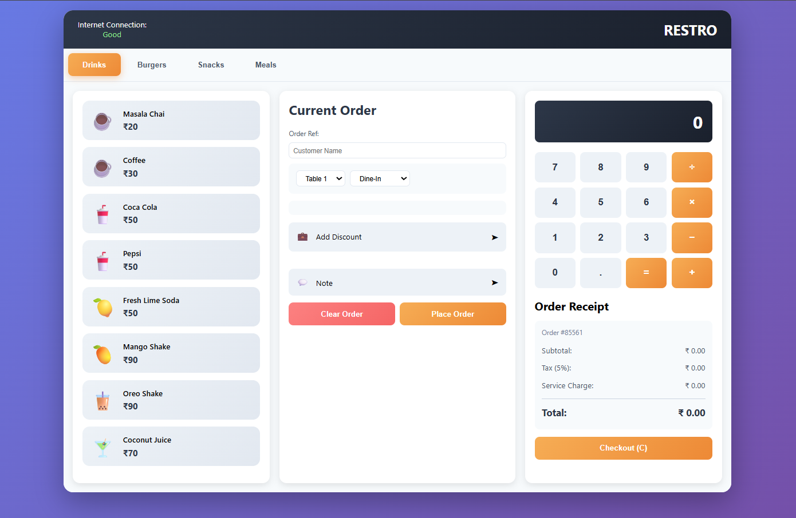

# Restaurant Management System

A modern, responsive web-based restaurant bill management and point-of-sale (POS) system built with vanilla HTML, CSS, and JavaScript. This application provides a comprehensive solution for managing food orders, calculating bills, and processing customer transactions.

## Project Output



The screenshot above shows the complete Restaurant Management System interface with menu items on the left, order management in the center, calculator and bill summary on the right.

## Problem Statement

Restaurants often struggle with manual order management, bill calculations, and customer service efficiency. This project addresses the need for:
- Quick and accurate bill generation without manual calculations
- Organized menu categorization for faster item selection
- Automated tax and service charge calculations
- Discount code management and application
- Reduced errors in order taking and billing
- A user-friendly interface for staff training and use

## Features Implemented

### 📋 Menu Management
- **Multi-category menu system** with 4 food categories:
  - **Drinks** (Masala Chai, Coffee, Coca Cola, Fresh Lime Soda, Shakes, etc.)
  - **Burgers** (Cheeseburger, Chicken Burger, Veg Burger, Paneer Burger, etc.)
  - **Snacks** (French Fries, Chicken Wings, Pizza, Sandwich, etc.)
  - **Meals** (Chicken Biryani, Veg Thali, Pasta Alfredo, Fried Rice Combo)
- Easy tab-based navigation between food categories
- Visual item representation with emojis for quick identification
- Prices displayed in Indian Rupees (₹)

### 🛒 Order Management
- **Add items** to order by clicking menu items (quantity auto-increments if added again)
- **Remove items** from order with individual remove buttons
- **Quantity tracking** for each item
- **Customer name input** for order personalization
- **Table selection** (Tables 1-5)
- **Dine-in/Take Away/Delivery** options
- **Special notes** feature for custom instructions

### 💰 Billing System
- **Automatic bill calculation** with:
  - Subtotal calculation
  - 5% tax calculation
  - 2% service charge
  - Discount application
- **Discount codes** with minimum purchase requirements:
  - `HAPPY100` - ₹100 off (minimum ₹300 order)
  - `FAMILY300` - ₹300 off (minimum ₹900 order)
  - `SPECIAL500` - ₹500 off (minimum ₹1500 order)
  - `LARGE2000` - ₹2000 off (minimum ₹6000 order)
- **Real-time bill updates** as items are added/removed
- **Print-friendly receipt** format with order reference number

### 🧮 Built-in Calculator
- Functional calculator with basic operations (+, −, ×, ÷)
- Display for calculations
- Keyboard support for calculator input
- Helpful for quick calculations during transactions

### 🖨️ Checkout Features
- **Print Bill** - Generate printable receipt
- **Checkout** - Complete order and print bill automatically
- **Auto-clear** - Order clears after successful checkout
- **Order Reference Number** - Unique identifier for each order
- **Bill Number** - Sequential billing reference

### ⌨️ Keyboard Shortcuts
- **Number keys** - Calculator input
- **Enter** - Calculate expression
- **P** - Print bill
- **C** - Checkout
- **Backspace** - Delete calculator entry
- **Enter in discount field** - Apply discount code

### 🎨 Design Highlights
- **Modern gradient UI** with purple/blue primary color scheme
- **Responsive 3-column layout**:
  - Left: Menu items
  - Center: Current order management
  - Right: Calculator and bill summary
- **Interactive hover effects** and smooth animations
- **Color-coded buttons** for different actions
- **Mobile-responsive** design with media queries
- **Professional typography** using Segoe UI font family

### 📱 Internet Connection Status
- Visual indicator showing internet connection status
- Displayed in the header for user awareness

## File Structure

```
Restaurant Management System/
├── index.html          # Main HTML structure
├── style.css           # Styling and layout
├── script.js           # Core functionality and logic
└── README.md          # Documentation (this file)
```

## Technologies Used

- **HTML5** - Semantic markup and structure
- **CSS3** - Modern styling with Flexbox and CSS Grid, gradients, animations
- **Vanilla JavaScript** - No dependencies, pure JavaScript implementation

## DOM Concepts Used

- **DOM Manipulation**: `getElementById()`, `querySelector()`, `createElement()`, `appendChild()` for dynamic element creation and removal
- **Event Handling**: `addEventListener()` for click, keydown, and input events
- **Event Delegation**: Managing clicks on menu items and calculator buttons efficiently
- **DOM Traversal**: `parentElement`, `children`, `nextSibling` for navigating the DOM tree
- **Dynamic Content**: Adding/removing order items, updating bill calculations in real-time
- **Attribute Manipulation**: `setAttribute()`, `getAttribute()` for managing data attributes
- **Class Manipulation**: `classList.add()`, `classList.remove()` for dynamic styling
- **Form Input Handling**: Working with input fields for customer name, discount codes, and notes
- **Window Methods**: `window.print()` for print functionality, `window.alert()` for user notifications
- **Local Storage**: Session-based data storage for current order (if implemented)

## Steps to Run the Project

1. **Opening the Application**
   - Open `index.html` in any modern web browser
   - Alternatively, use VS Code Live Server extension for development

2. **Selecting Items**
   - Click on food category tabs (Drinks, Burgers, Snacks, Meals)
   - Click on any menu item to add it to the current order
   - Item quantity increases if the same item is added again

3. **Managing Order**
   - Enter customer name in the provided field
   - Select the appropriate table number
   - Choose dine-in, take away, or delivery option
   - Add special notes if needed (click "Note" section)

4. **Applying Discount**
   - Click "Add Discount" section
   - Enter one of the valid discount codes
   - Ensure your order meets the minimum purchase requirement
   - Click "Apply Code" or press Enter

5. **Calculating Bill**
   - Bill updates automatically as items are added/removed
   - View subtotal, tax, service charge, and discounts
   - Final total is displayed prominently

6. **Checkout**
   - Click "Checkout (C)" button or press C key
   - Confirm to print bill
   - System automatically clears order and generates new order reference

7. **Calculator**
   - Use calculator buttons or keyboard for quick calculations
   - Support for +, −, ×, ÷ operations
   - Press = or Enter to calculate

## Features in Detail

### Discount System
- Discount codes must meet minimum purchase thresholds (3x the discount amount)
- If threshold not met, alert shows how much more is needed
- Applied discount is visually displayed in the order section
- Discount amount is clearly shown in the bill summary

### Bill Summary
- **Unique order reference number** for tracking
- **Customer name** (if provided)
- **Itemized list** showing quantity and price for each item
- **Subtotal** - Sum of all items
- **Tax** - 5% of subtotal
- **Service Charge** - 2% of subtotal
- **Discount** - Applied discount (if any)
- **Total** - Final amount due

### Print Functionality
- Print-optimized layout using CSS media queries
- Shows only the bill section when printing
- Includes order reference, customer info, and itemized list
- Works across all browsers supporting print functionality

## Browser Compatibility

- Chrome/Edge (Recommended)
- Firefox
- Safari
- Opera

## Notes

- All prices are in Indian Rupees (₹)
- Application uses local storage for current session only
- No backend required - fully client-side application
- Perfect for small to medium-sized restaurants

## Video Explanation

📹 **Watch the project explanation and demonstration video:**

[Restaurant Management System - Explanation Video](https://drive.google.com/file/d/12Fc7siCTim985eMC00bho1GrdZWxv_si/view?usp=drive_link)

This video covers the features, functionality, and usage of the Restaurant Management System.

## Known Limitations

- **No Persistent Storage**: Orders are not saved after closing the browser (client-side only)
- **No Database Backend**: Cannot store historical order data, sales reports, or analytics
- **No User Authentication**: No staff login or role-based access control
- **No Payment Integration**: Does not process actual payments or connect to payment gateways

## Future Enhancements

Potential improvements for future versions:
- Local storage for order history
- User authentication for staff management
- Inventory management
- Analytics and sales reports
- Multiple language support
- Payment gateway integration
- Mobile app version

## License

This is a free, open-source restaurant management system.

## Support

For issues or feature requests, please contact the development team.

---

**Version**: 1.0  
**Last Updated**: January 2026
